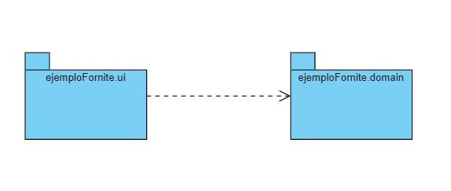

# Fortnite con una estructura de paquetes

## Diagrama de clases


## Diagrama de paquetes


## Compilación y ejecución

```bash
C:\POO\sources\javaCourseExamples\05c3.paquetes>dir
16/02/2022  11:51    <DIR>          .
16/02/2022  11:51    <DIR>          ..
16/02/2022  11:33    <DIR>          ejemploFornite
16/02/2022  11:52               631 README.md
```

```bash
C:\POO\sources\javaCourseExamples\05c3.paquetes>tree
C:.
└───ejemploFornite
    ├───domain
    └───ui
```

```bash
C:\POO\sources\javaCourseExamples\05c3.paquetes>javac ejemploFornite\ui\AppPersonaje.java
```

```bash
C:\POO\sources\javaCourseExamples\05c3.paquetes>java ejemploFornite.ui.AppPersonaje
100
Personaje1:
        Usuario: The Grefg
        Vida: 90
        Material: 80
        Mundo: Mundo 2022
Personaje2:
        Usuario: Ampeter
        Vida: 100
        Material: 30
        Mundo: Mundo 2022
```

