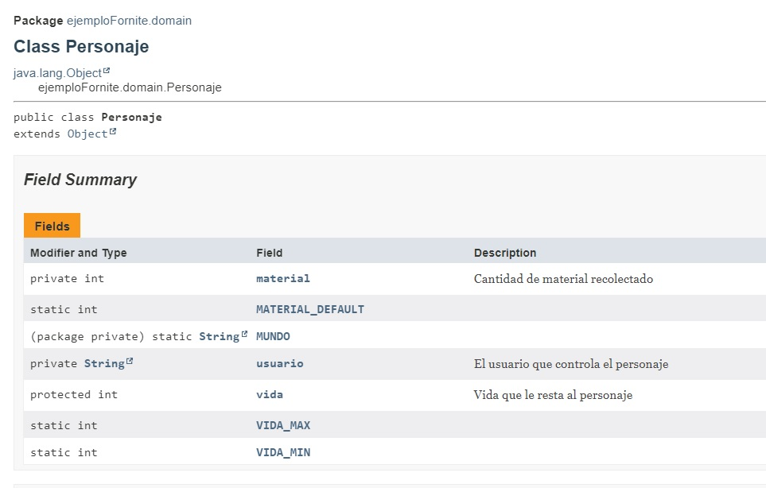

# Generación de documentación del código: Javadoc

La herramienta para generar la documéntación es **JAVADOC**, incluida en el compilador de Java.

Le podemos pasar como parámetros a partir de qué visibilidad (modificador mostrar). Por defecto solo documenta a partir de package/por defecto y las clases Java a documentar.

```bash
C:\>"C:\Program Files\Java\jdk-16.0.1\bin\javadoc.exe" -private ejemploFornite\ui\*.java ejemploFornite\domain\*.java
```

Este comando genera muchos ficheros HTML correspondientes a la documentación de nuestro programa, pero el fichero INDEX.HTML será el punto de partida a partir del cual navegaremos por nuestras clases.

En este contexto, cobra especial importancia los comentarios específicos de esta documentación que deben empezar por /** .

```java
/** El usuario que controla el personaje */
private String usuario;
/** Vida que le resta al personaje */
protected int vida;
/** Cantidad de material recolectado */
private int material;
```

```java
/** Constructor que inicializa todos los atributos del objeto:
 * @param usuario - usuario
 * @param vida - vida del personaje
 * @param material - cantida de material
 */
public Personaje(String usuario, int vida, int material)
{
        this.usuario = usuario;
        this.setVida(vida);
        this.setMaterial(material);
}
```

```java
/** Getter del usuario
 * @return usuario del personaje
 */
public String getUsuario()
{
        return usuario;
}
```

Ejemplo de una de las páginas HTML generadas:




