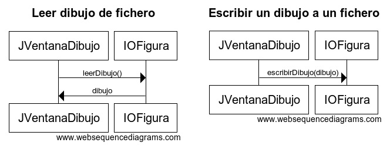

## Práctica 11. Java Avanzado. Ficheros.
### Guardar las figuras pintadas en un fichero.

#### Funcionalidad

Tomar como base la práctica anterior de la aplicación de dibujo con eventos y excepciones y añadir la funcionalidad de escritura/lectura de figuras.

Al iniciar la aplicación se leerá el Dibujo de un fichero y se pintará. En el caso de no existir el fichero, se iniciará un dibujo nuevo. Al finalizar la aplicación (pulsar X), se guardará el Dibujo en el mismo fichero.

El programa sólo trabajará con un fichero y no dará la posibilidad de especificar un nombre. Esa funcionalidad extra se dejará para la práctica final.

#### Diseño 

La funcionalidad de Entrada/Salida se programará en una clase independiente (IOFigura) separando así la lógica de ui, objetos y entrada y salida. Por ello, esta clase se encontrará en un nuevo paquete denominado practica11.io.

