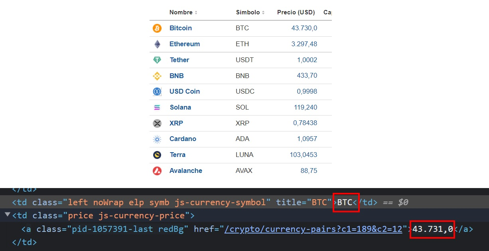
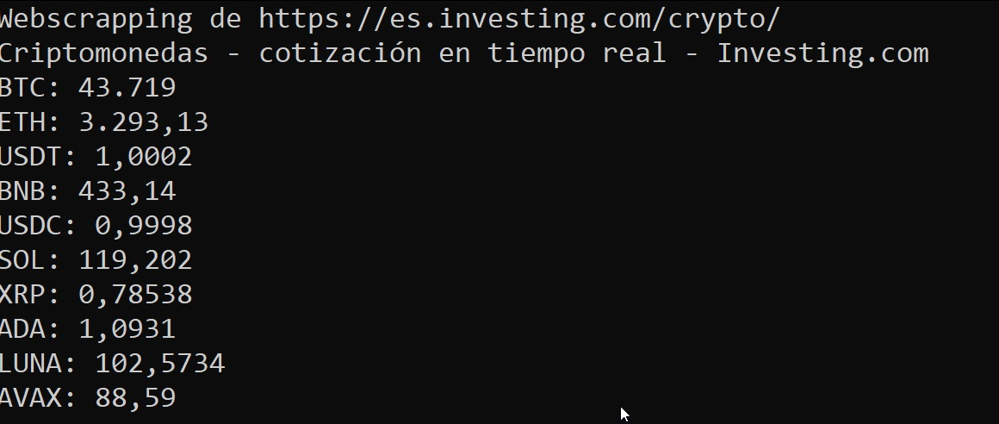

# Webscrapping con JSOUP
### Ejemplo de cotizaciones de criptos



### Automatización de compilación y ejecución (básico)

```bash
javac -cp .;jsoup-1.13.1.jar AppNoticiasMarca.java 
java -cp .;jsoup-1.13.1.jar AppNoticiasMarca 
```

### Automatización de compilación, dependencias y empaquetado de aplicaciones (avanzado)

Fichero pom.xml de configuración:

```xml
<project xmlns="http://maven.apache.org/POM/4.0.0" xmlns:xsi="http://www.w3.org/2001/XMLSchema-instance" xsi:schemaLocation="http://maven.apache.org/POM/4.0.0 http://maven.apache.org/maven-v4_0_0.xsd">
  <modelVersion>4.0.0</modelVersion>
  <groupId>edu.comillas.gitt</groupId>
  <artifactId>EjemploWebscrapping</artifactId>
  <packaging>jar</packaging>
  <version>1.0-SNAPSHOT</version>
  <name>EjemploWebscrapping</name>
  <url>http://maven.apache.org</url>
  <build>
    <plugins>
      <plugin>
        <groupId>org.apache.maven.plugins</groupId>
        <artifactId>maven-compiler-plugin</artifactId>
        <version>3.8.1</version>
        <configuration>
            <source>1.8</source>
            <target>1.8</target>
        </configuration>
      </plugin>
      <plugin>
        <artifactId>maven-assembly-plugin</artifactId>
        <executions>
          <execution>
            <phase>package</phase>
            <goals>
              <goal>single</goal>
            </goals>
          </execution>
        </executions>
        <configuration>
          <archive>
            <manifest>
              <mainClass>AppNoticiasMarca</mainClass>
            </manifest>
          </archive>          
          <descriptorRefs>
            <descriptorRef>jar-with-dependencies</descriptorRef>
          </descriptorRefs>
        </configuration>
      </plugin>      
    </plugins>
    </build>
   <dependencies>
        <dependency>
            <groupId>org.jsoup</groupId>
            <artifactId>jsoup</artifactId>
            <version>1.13.1</version>
        </dependency>
    </dependencies>
</project>
```

```bash
$ mvn package

[INFO] Scanning for projects...
[INFO]
[INFO] ---------------< edu.comillas.gitt:EjemploWebscrapping >----------------
[INFO] Building EjemploWebscrapping 1.0-SNAPSHOT
[INFO] --------------------------------[ jar ]---------------------------------
[INFO] --- maven-jar-plugin:2.4:jar (default-jar) @ EjemploWebscrapping ---
[INFO] Building jar: C:\Users\David\Documents\Poo\sources\javaCourseExamples\11c4.webscrapping\proyectoMaven\target\EjemploWebscrapping-1.0-SNAPSHOT.jar
[INFO] ------------------------------------------------------------------------
[INFO] BUILD SUCCESS
[INFO] ------------------------------------------------------------------------
[INFO] Total time:  7.626 s
[INFO] Finished at: 2022-04-08T11:02:19+02:00
[INFO] ------------------------------------------------------------------------
```
Generará como resultado un fichero "ejecutable" JAR: **EjemploWebscrapping-1.0-SNAPSHOT.jar**

