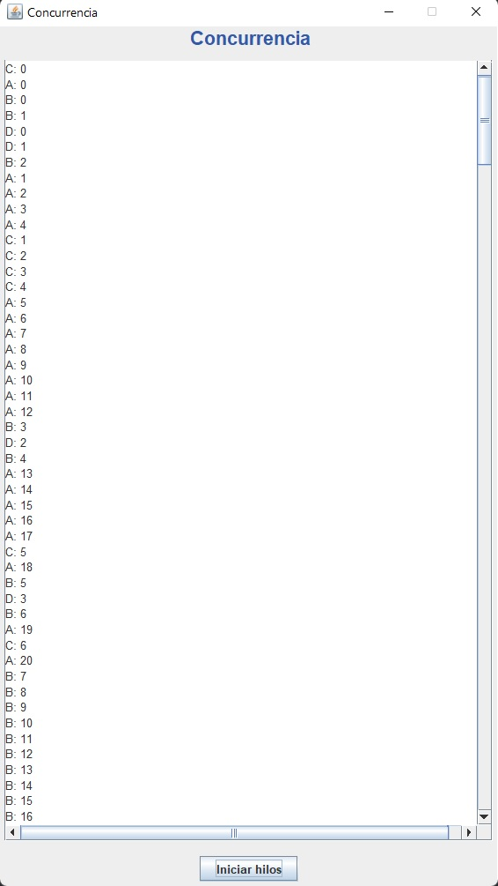

## Ejemplo de Threads. Concurrencia y Bloqueos

Se describe de una forma gráfica la problemática del acceso concurrente a un recurso compartido y cómo el planificador (scheduler) da prioridad a los hilos al procesador.

```java
/* Este modificador evita que entren más de un hilo a la vez en el método */

public synchronized void actualizarTexto(String texto)
{
    txtWeb.append(texto + "\n");
}
```

Se puede observar cómo NO se producen dos ejecuciones idénticas.

