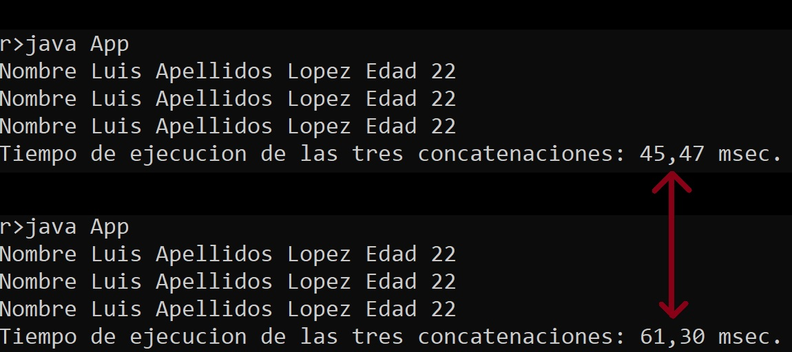

# Becnhmarking Concatenaciones con Strings
En la clase de hoy hemos visto tres tipos de concatenaciones que se resumen en el código que se suministra en el [App.java](App.java):
- Operador +.
- StringBuilder.
- String.format.

Se pide realizar un par de programas de micro-benchmarking que generen los siguientes resultados:
- Rendimiento de los 3 tipos de concatenaciones a partir del ejemplo del [App.java](App.java). En ese ejemplo se mide el tiempo total de ejecución del programa (no aporta valor). Tomadlo como punto de partida para realizar un benchmarking con criterio. Se promediarán los resultados obtenidos para evitar las grandes varianzas que se pueden dar entre ejecuciones, como se puede ver:

- Investigar cuál es el tiempo de ejecución del "operador +" vs "String Builder" de 0 a 10 iteraciones con incrementos de 1 y de 0 a 100 con incrementos de 10. Deberéis decidir cuál es el punto de inflexión a partir del cual debemos utilizar StringBuilder en lugar del operador +.

